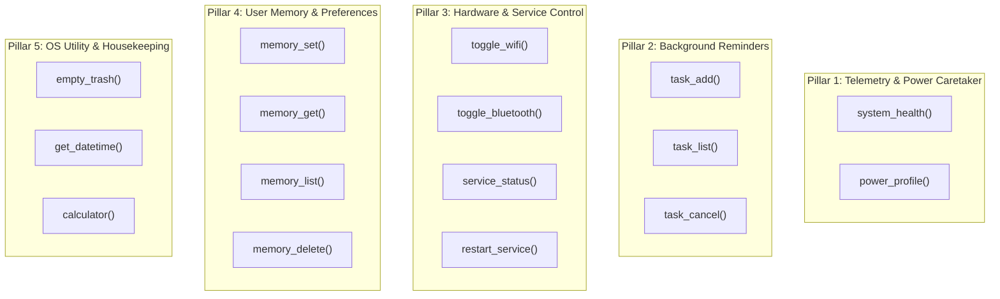
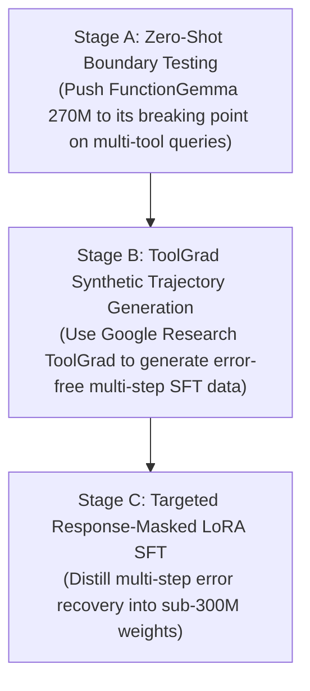

# 🎩 NanoHat: Autonomous Fedora OS Caretaker
## Master Architectural & System Specification (v3.0.0-RFC)

> **Document Status**: Canonical Architecture Specification  
> **Target Audience**: Core Engineers, Autonomous Subagents, and External Frontier AI Auditors (Claude 3.5, GPT-4o, DeepSeek V3).  
> **Goal**: A definitive, verifiable blueprint establishing the complete requirements, operational boundaries, and distillation roadmap for NanoHat as an always-on, autonomous Linux OS caretaker.

---

## 1. Executive Summary & Strategic Vision

**NanoHat** is an all-time active, autonomous AI agent and OS caretaker purpose-built for **Fedora Linux Workstation**. 

Unlike conversational chatbots or generic web-scraping agents, NanoHat functions as a **deterministic, background system daemon and CLI companion**. It continuously monitors system health, diagnoses performance bottlenecks, manages user-space services, automates desktop housekeeping, and delivers reliable notifications—all while operating strictly within the resource constraints of low-spec and entry-level laptops.

### The 4 Linux Pillars (Non-Negotiable Constraints)

1. **Absolute Sovereignty & Offline Privacy**:
   - 100% local execution via Ollama / GGUF.
   - Zero telemetry, zero cloud dependencies, zero external network leakage.
   - All tool calls execute against local host APIs, CLI utilities, or persistent local state.

2. **Extreme Resource Efficiency (The 4GB–8GB Envelope)**:
   - **Host Target**: Runs smoothly on entry-level hardware with a single CPU core and 4GB to 8GB of total RAM.
   - **Inference Footprint**: Capped at **$\le 300\text{ MB}$ RAM** (`FunctionGemma 270M` Q8_0 or sub-1B Q4_K_M).
   - **Idle Footprint**: Near 0% CPU consumption in daemon mode; lightweight file-based polling or event-driven wakeups.

3. **High-Utility Prudence (Anti-Bloat)**:
   - We explicitly reject flashy, redundant gimmicks (e.g. typing a terminal command to take a screenshot or lock the screen when hardware keys exist).
   - We prioritize high-impact, daily-driver capabilities: system telemetry, service recovery, background reminders, and configuration memory.

4. **Fail-Safe Security & Shell Isolation**:
   - Zero raw bash interpolation: all command invocations use explicit argument lists (`subprocess.run(["cmd", "arg"], shell=False)`).
   - Destructive operations fail closed by default: require explicit interactive confirmation or a secure headless flag.
   - Safe AST parsing for mathematical evaluation—Python's `eval()` is strictly prohibited.

---

## 2. Hardware & Runtime Operating Envelope

```
┌─────────────────────────────────────────────────────────────┐
│                 NanoHat Operating Envelope                   │
├─────────────────────────────┬───────────────────────────────┤
│ Target Operating System     │ Fedora Linux 40+ Workstation  │
│ Architecture                │ x86_64 / aarch64              │
│ Desktop Environment         │ GNOME (Wayland native)        │
│ Total System RAM Budget     │ 4 GB to 8 GB (Host Total)     │
│ Agent Model RAM / VRAM      │ ≤ 300 MB (FunctionGemma 270M) │
│ Agent Daemon RAM            │ ≤ 40 MB (Python native worker)│
│ Single-Shot Turn Latency    │ < 500 ms (Inference + Exec)   │
│ Disk Footprint              │ < 1.0 GB (Weights + Runtime)  │
└─────────────────────────────┴───────────────────────────────┘
```

---

## 3. The 5 Functional Pillars & Core Tool Catalog

NanoHat consolidates its capabilities into **15 discrete, hardened, and testable tool units** organized across 5 core operational pillars:



### Detailed Functional Specifications

| # | Tool Name | Scope & Purpose | Input Schema | Concurrency & Safety Gate |
|---|---|---|---|---|
| **1** | `system_health` | Queries real-time Linux metrics: CPU load, RAM usage, swap, disk space, and battery status/percent. | `metric: str = "all"` | Read-only (`psutil`). Supports targeted filtering (`metric="battery"`), returns integer %. |
| **2** | `power_profile` | Inspects or switches GNOME power profiles (`power-saver`, `balanced`, `performance`). | `action: str = "get", profile: str = ""` | Safe subprocess (`powerprofilesctl`). Prevents thermal throttling & extends battery life. |
| **3** | `task_add` | Registers a timed task or reminder with absolute or relative due time in SQLite WAL store. | `task: str, due_at: str` | **SQLite WAL Atomic Write** (`state.db`). Dispatches desktop alert when due. |
| **4** | `task_list` | Queries pending, overdue, or completed scheduled tasks from SQLite. | `status: str = "pending"` | Read-only SQLite query. |
| **5** | `task_cancel` | Cancels or removes a scheduled reminder by ID in SQLite. | `task_id: str` | Safe state transition in `state.db`. |
| **6** | `toggle_wifi` | Inspects or toggles NetworkManager Wi-Fi radio. | `state: str = "toggle"` | Safe subprocess (`nmcli radio wifi`). |
| **7** | `toggle_bluetooth`| Inspects or toggles BlueZ Bluetooth controller power. | `state: str = "toggle"` | Safe subprocess (`bluetoothctl power`). |
| **8** | `service_status` | Inspects systemd unit active state, failure status, or restart count before taking action. | `service_name: str` | Read-only (`systemctl --user is-active <service>`). Eliminates blind restarts. |
| **9** | `restart_service` | Restarts an allowlisted user systemd unit (e.g. `pipewire`, `wireplumber`, `ollama`). | `service_name: str` | **Strict Allowlist + Fail-Closed TTY Guard**. Hard-blocks `gnome-shell` to prevent Wayland session crash. |
| **10**| `memory_set` | Persists a user key-value note, dotfile path, or preference in SQLite WAL store. | `key: str, value: str` | **SQLite WAL Atomic Write** (`~/.local/state/nanohat/state.db`). XDG State compliant. |
| **11**| `memory_get` | Retrieves a stored key or preference from persistent memory. | `key: str` | Read-only SQLite query. |
| **12**| `memory_list` | Lists all active persistent memory keys. | None | Read-only SQLite query. |
| **13**| `memory_delete`| Deletes a key from persistent user memory. | `key: str` | **Fail-Closed TTY Confirmation** on key removal. |
| **14**| `empty_trash` | Purges the user GNOME trash bin safely. | None | **Fail-Closed TTY Confirmation** (`gio trash --empty`). Non-interactive guard. |
| **15**| `get_datetime` | Returns current local timestamp, ISO date, day of week, and timezone. | None | Read-only native Python `datetime`. |
| **16**| `calculator` | Evaluates complex arithmetic and math expressions safely. | `expression: str` | AST-walked parser (No `eval()`, operand caps). Secondary utility. |

---

## 4. The Anti-Scope (Explicit Non-Goals)

To preserve performance, reliability, and security, the following capabilities are **permanently excluded** from the core NanoHat runtime:

* 🚫 **No Typing-to-Launch Apps**: In a keyboard/CLI environment, pressing `Super` + typing an app name launches software in ~0.2s. Typing `nanohat "launch vlc"` introduces pure friction. App launching is deferred to v4.x when native voice input is introduced.
* 🚫 **No Arbitrary Service Restarts (Wayland Crash Risk)**: In Fedora 44 GNOME 50, restarting `org.gnome.Shell@wayland` or `gnome-session*` immediately terminates the graphical user session. Only safe user-space daemons (`pipewire`, `wireplumber`, `xdg-desktop-portal`, `ollama`) are allowlisted.
* 🚫 **No Open-Web Scraping in Core**: The core daemon does not perform open web searches. Web scraping is slow, fragile, network-dependent, introduces SSL certificate vulnerabilities, and leaks user query intent.
* 🚫 **No Uncontrolled Process Killing (`kill_process`)**: Granting a small model the power to terminate processes risks killing `systemd`, `gnome-shell`, `wayland`, the terminal emulator, or the agent itself.
* 🚫 **No Bloated Multi-Gigabyte Models**: Models over 2B parameters cause thermal throttling and memory starvation on 8GB laptops. NanoHat strictly targets the sub-1B tier.
* 🚫 **No Heavy GUI Wrappers**: NanoHat is a native CLI console utility and background systemd service—never an Electron or Chromium-based app.


---

## 5. System Architecture & Lifecycle

NanoHat operates in a decoupled dual-mode architecture:

```
┌─────────────────────────────────────────────────────────────┐
│                     Interactive CLI Client                  │
│                     `nanohat "<prompt>"`                    │
└──────────────────────────────┬──────────────────────────────┘
                               │ IPC / Local Sockets
                               ▼
┌─────────────────────────────────────────────────────────────┐
│                 NanoHat Runtime & Agent Engine               │
│  ┌────────────────────┐   ┌──────────────────────────────┐  │
│  │ Zero-Shot Gemma    │   │ Dispatch & Tool Registry     │  │
│  │ Prompt Harness     │   │ (14 Hardened Tools)          │  │
│  └────────────────────┘   └──────────────────────────────┘  │
└──────────────────────────────┬──────────────────────────────┘
                               │
                               ▼
┌─────────────────────────────────────────────────────────────┐
│                 Systemd User Background Daemon               │
│  • Monitors `tasks.json` every 20 seconds                   │
│  • Dispatches desktop alerts via `notify-send`              │
│  • Auto-restarts on system boot (`systemctl --user enable`) │
└─────────────────────────────────────────────────────────────┘
```

---

## 6. Scaling Strategy: Zero-Shot Limits & ToolGrad Distillation

Small sub-300M models face acute cognitive limits on multi-hop reasoning. NanoHat adheres to a 3-stage empirical evolution strategy:



### Stage A: Zero-Shot Limit Discovery
- Push base `FunctionGemma 270M` without in-context exemplars.
- Benchmark:
  1. Single-turn exact tool routing accuracy.
  2. Multi-tool composite requests (e.g. "Check CPU and if battery is below 20% toggle wifi off").
  3. Argument extraction robustness under typos and natural variations.
- Record failure cases into `eval/failures.jsonl`.

### Stage B: ToolGrad Trajectory Generation
- Leverage **ToolGrad** ([arXiv:2508.04086](https://arxiv.org/pdf/2508.04086), [Google Research](https://research.google/blog/toolgrad-efficient-tool-use-dataset-generation-with-textual-gradients/)).
- **Methodology**: Rather than raw prompt distillation (which generates hallucinated arguments), ToolGrad uses textual gradients—backward step-by-step execution feedback from the live Fedora environment—to iteratively refine tool trajectories until they achieve 100% execution validity.
- Produce 20,000–50,000 verified multi-turn OS interaction trajectories focusing on:
  - Multi-step diagnosis (e.g. detect high memory -> inspect services -> restart glitching unit).
  - Autonomous error recovery (e.g. handle invalid argument -> query alternative -> succeed).

### Stage C: Distillation & Production Release
- Train `FunctionGemma 270M` using response-only loss masking (labels = -100 for user and environment tokens).
- Target metric: **>98% tool routing precision, <1% hallucination rate, and zero-shot multi-step recovery**.

---

## 7. Frontier Model Audit & Verification Protocol

> **Instructions for Reviewing Frontier Models (Claude 3.5 Sonnet, GPT-4o, DeepSeek V3)**:  
> Review this specification against real-world Linux system administration requirements and answer the following audit questions:

### Audit Questions for Frontier AI Evaluators
1. **Scope Sufficiency**: Does this 14-tool catalog provide complete coverage for an autonomous desktop caretaker, or are there critical operational blind spots?
2. **Safety Gates**: Is the fail-closed security model sufficient to prevent host instability in non-interactive / headless deployments?
3. **Hardware Realism**: Can `FunctionGemma 270M` combined with `ToolGrad` multi-step fine-tuning achieve autonomous service self-healing within the 300MB RAM budget?
4. **Daemon Architecture**: Are there potential race conditions or locking conflicts between the CLI client and the background `systemd` user notifier when reading/writing `tasks.json` and `memory.json`?

---

## 8. Verification Checklist for Milestone v3.0.0

- [x] **Runtime Hardened**: Integer battery percent, double-print removed, zero medical refusals.
- [x] **Batch 1 Complete**: `calculator`, `system_health` (targeted metrics), and `power_profile` integrated and verified.
- [x] **Batch 2 Complete**: `get_datetime` and `empty_trash` (TTY guarded) integrated and verified.
- [x] **Batch 3 Complete**: `toggle_wifi`, `toggle_bluetooth`, `service_status`, and `restart_service` (Wayland allowlist protected) integrated and verified.
- [ ] **Batch 4 Complete**: SQLite WAL mode engine (`state.db`) with `memory_*` (4 units) and `task_*` (3 units) persistence verified.
- [ ] **Packaging Verified**: Standalone CLI binary `nanohat-v3` runnable from host shell.
- [ ] **Zero-Shot Boundary Benchmark**: Automated harness executing benchmark queries.
