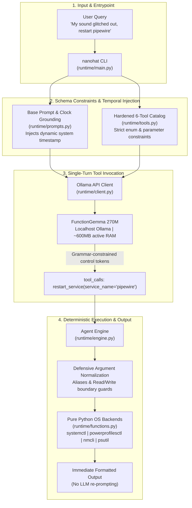

# 🎩 NanoHat v3.1.0: Autonomous Sub-300M Linux OS Copilot

> *"Fine-tuning is the last resort. First, try all methods of systems engineering."*

**NanoHat** is an ultra-lightweight, offline autonomous Linux system copilot running on Fedora Workstation. Powered by **FunctionGemma 270M** and a zero-dependency Python runtime, NanoHat bridges the gap between natural language symptoms and low-level Linux administration. It diagnoses system health, controls hardware radios, manages power profiles, and recovers failed systemd user services without cloud dependencies, complex orchestration frameworks, or heavy router overhead.

---

## Architecture: Direct-Dispatch vs. Cognitive Dilution

In sub-1B parameter models like FunctionGemma 270M, traditional agent frameworks break down for two reasons:

* **Context Dilution:** Large tool surfaces overload the model's limited attention window, resulting in parameter dropping and schema confusion.
* **Synthesis Looping:** Re-prompting a 270M function-calling checkpoint with tool results to synthesize conversational dialogue leads to empty responses, conversational refusals, or infinite tool calls.

NanoHat v3.1.0 bypasses routing layers and synthesis loops entirely. It presents a static, hardened catalog of 6 core system tools directly to the model and executes an immediate, deterministic dispatch:



* **Zero-Router Direct Dispatch:** Evaluates the entire 6-tool catalog directly within the model's native attention budget, eliminating routing drift and vector embedding overhead.
* **Dynamic Temporal Grounding:** Injects the live host timestamp into the prompt on every turn, eliminating temporal hallucinations without consuming a tool slot.
* **Deterministic Execution Loop:** Intercepts function calls and returns templated system output directly to the terminal, bypassing model re-prompting.
* **Defensive Parameter Normalization:** Sanitizes argument aliases and isolates read-only telemetry queries from destructive actions.

---

## Hardened Core Tool Catalog

The runtime is locked to 6 system administration tools strictly scoped to Linux operations:

| Tool | Action Scope | Backend Command / Mechanism |
| --- | --- | --- |
| `system_health` | Query CPU %, RAM usage, or battery charge (`battery`, `ram`, `cpu`, `all`) | `psutil` virtual memory, CPU percent, battery sensors |
| `power_profile` | Inspect or switch energy profiles (`power-saver`, `balanced`, `performance`) | `powerprofilesctl get` / `powerprofilesctl set <profile>` |
| `toggle_wifi` | Check Wi-Fi state or toggle adapter power (`status`, `on`, `off`, `toggle`) | `nmcli radio wifi` |
| `toggle_bluetooth` | Check Bluetooth power or toggle adapter state (`status`, `on`, `off`, `toggle`) | `bluetoothctl show` / `bluetoothctl power <state>` |
| `service_status` | Inspect systemd unit states across user and system scopes | `systemctl --user is-active` / `systemctl is-active` |
| `restart_service` | Restart allowlisted user-space daemons with Wayland protection | `systemctl --user restart <unit>.service` |

---

## Installation & Setup

### 1. Prerequisites (Ollama)

Ensure Ollama is running locally and pull the FunctionGemma model:

```bash
ollama pull functiongemma:latest

```

### 2. Install NanoHat Globally

#### Via Pipx:

```bash
pipx install git+https://github.com/aetherflow-bit/nanohat-v3.git@v3.1.0

```

#### Or Local Development:

```bash
git clone https://github.com/aetherflow-bit/nanohat-v3.git
cd nanohat-v3
pip install -e .

```

---

## Usage Examples

Run commands directly from your terminal:

```bash
# Hardware Telemetry & Health Checks
nanohat "How much battery do I have left?"
nanohat "What's my current RAM usage?"
nanohat "Check CPU load right now"
nanohat "Show complete system health"

# Energy Profile Management
nanohat "What power profile is currently active?"
nanohat "Switch power profile to power-saver"
nanohat "Set energy profile to performance"

# Wireless Radio Control
nanohat "Is Wi-Fi turned on?"
nanohat "Turn off the Wi-Fi radio"
nanohat "Check Bluetooth status"
nanohat "Turn on Bluetooth"

# Service Inspection & Daemon Recovery
nanohat "Is pipewire running?"
nanohat "Check status of ollama service"
nanohat "What is the state of wireplumber?"
nanohat "Restart pipewire service"

# Symptom-Based Troubleshooting
nanohat "My laptop feels super hot, check CPU usage"
nanohat "Sound glitched out, restart the audio service pipewire"
nanohat "I am low on charge, switch profile to power-saver"

```

### Verbose Execution Diagnostics

Inspect system prompts, parameter normalization, and raw tool calls:

```bash
nanohat --verbose "check battery status"

```

---

## Repository Structure

```text
NanoHat/
├── runtime/
│   ├── main.py          # CLI entry point and argument parsing
│   ├── engine.py        # Direct-dispatch orchestrator and argument normalizer
│   ├── prompts.py       # Minimal system prompt with dynamic clock injection
│   ├── tools.py         # 6-tool JSON schema definitions with enum constraints
│   ├── functions.py     # Linux OS execution handlers (systemctl, nmcli, psutil)
│   └── client.py        # Native Ollama API client
├── tests/
│   ├── conftest.py      # Subprocess safety interceptors (mocking destructive binaries)
│   └── stress/          # Persona, colloquial, and security fuzzing test suites
├── benchmarks/          # Latency and schema accuracy benchmarks
├── pyproject.toml       # Build and dependency configuration
├── LICENSE              # Apache-2.0
└── README.md

```

---

## Security & Fail-Closed Safeguards

* **Wayland Crash Shield:** Rejection of desktop components (`gnome-shell`, `gdm`, `wayland`) inside `restart_service` prevents session termination.
* **Allowlisted Daemon Control:** Service restarts are strictly limited to user-space utilities (`pipewire`, `wireplumber`, `xdg-desktop-portal`, `ollama`).
* **Path Traversal Defense:** Sanitization on unit names blocks directory traversal attempts (`../`) and illegal path separators.
* **Read-Only Question Guards:** Intercepts question queries like *"Is Wi-Fi on?"* to enforce read-only status calls without mutating radio state.
* **Zero Cloud Leakage:** Executes entirely on localhost (`127.0.0.1:11434`) without external HTTP requests or network telemetry.

---

## License

Licensed under the Apache License, Version 2.0.