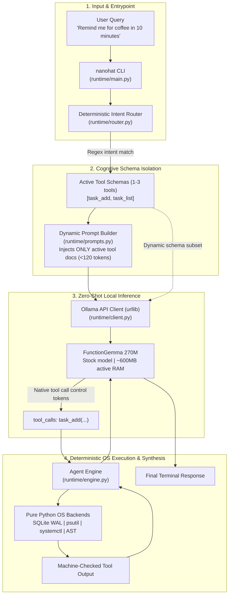

# 🎩 NanoHat v3.1.0: Autonomous Sub-300M Linux OS Agent

> *"Fine-tuning is the last resort. First, try all methods of systems engineering."*

[](LICENSE)
[](#)
[](#)
[](#)

**NanoHat** is an ultra-lightweight, offline-first autonomous OS agent that runs locally with **sub-second CPU latency** and a **~600MB RAM footprint**. 

Powered by **FunctionGemma 270M** and a zero-dependency Python runtime, NanoHat executes system telemetry, systemd daemon recovery, hardware radio control, persistent user memory, and task scheduling without relying on cloud APIs or heavy orchestration frameworks.

---

## The Core Breakthrough: Intent Routing vs. Context Dilution

In sub-1B parameter models, the primary failure mode is **context dilution**. Exposing a 270M model to 16 complex tool schemas simultaneously saturates its attention window, causing hallucinations, syntax errors, and execution loops.

NanoHat v3.1.0 resolves this through **clean systems architecture rather than brute-force fine-tuning**:



1. **Deterministic Intent Router (`runtime/router.py`):** Pre-compiled regex clusters classify query intent and dynamically prune the active tool catalog down to **1–4 candidate tools** per turn.
2. **Dynamic Prompt Assembly (`runtime/prompts.py`):** Injects steering instructions *only* for the active tool subset, keeping prompt overhead under 120 tokens.
3. **Native Control Tokens:** Leverages FunctionGemma's native tool-calling tokens directly out-of-the-box without needing custom fine-tuned weights.

---

## Canonical Tool Surface (16 Tools across 5 Pillars)

| Pillar | Tools | Backend Implementation |
| :--- | :--- | :--- |
| **1. Telemetry & Power** | `system_health`, `power_profile` | `psutil` (CPU %, RAM GB/%, battery), `powerprofilesctl` |
| **2. Hardware & Radios** | `toggle_wifi`, `toggle_bluetooth` | `nmcli radio wifi`, `rfkill` |
| **3. Services & Daemons** | `service_status`, `restart_service` | `systemctl --user` (with strict security allowlisting) |
| **4. Persistent Memory** | `memory_set`, `memory_get`, `memory_list`, `memory_delete` | SQLite WAL state engine at `~/.local/state/nanohat/state.db` |
| **5. Scheduling & Housekeeping** | `task_add`, `task_list`, `task_cancel`, `get_datetime`, `calculator`, `empty_trash` | SQLite WAL tasks, Python AST math parser, `gio trash --empty` |

---

## Quickstart & Installation

### 1. Prerequisites (Ollama)
Pull the sub-300M FunctionGemma model:
```bash
ollama pull functiongemma
```

### 2. Install NanoHat Globally

#### Via Pipx (Recommended for CLI isolation):
```bash
pipx install git+https://github.com/aetherflow-bit/nanohat-v3.git@v3.1.0
```

#### Or Local Development Install:
```bash
git clone https://github.com/aetherflow-bit/nanohat-v3.git
cd nanohat-v3
pip install -e .
```

---

## Usage Examples

### Single-Shot Direct Execution
Run any command directly from your terminal:

```bash
# System Telemetry & Power
nanohat "What is my current RAM and CPU usage?"
nanohat "Check battery status"
nanohat "Set power profile to power-saver"

# Hardware & Daemons
nanohat "Is bluetooth on?"
nanohat "Turn off wifi"
nanohat "Status of pipewire"
nanohat "Restart ollama"

# Persistent Memory (Key-Value Store)
nanohat "Remember my favorite editor is neovim"
nanohat "What is my editor?"
nanohat "List all my memories"
nanohat "Forget my favorite editor"

# Task Scheduling & Alerts
nanohat "Remind me for coffee in 10 minutes"
nanohat "List my pending tasks"
nanohat "Cancel task 1"

# Utilities & Math
nanohat "What time is it right now?"
nanohat "What is 1024 * 768 / 16?"
nanohat "Empty trash"
```

### Verbose Mode & Diagnostics
Inspect the active tools, dynamic prompt, and raw model tool-calls in real-time:
```bash
nanohat --verbose "Check RAM usage"
```

---

## Project Architecture

```text
smollm2-fedora-agent/
├── runtime/
│   ├── main.py          # Dual-mode CLI entrypoint & argument parser
│   ├── router.py        # Regex intent classifier (dynamic tool gating)
│   ├── prompts.py       # Dynamic system prompt assembler
│   ├── tools.py         # OpenAI/Ollama compliant tool JSON schemas
│   ├── engine.py        # Multi-step execution & tool dispatch orchestrator
│   ├── functions.py     # Pure Python OS implementations & alias resolver
│   ├── db.py            # SQLite WAL persistent state engine
│   └── client.py        # Zero-dependency urllib Ollama API chat client
├── pyproject.toml       # Modern packaging specification
├── LICENSE              # Apache-2.0
└── README.md
```

---

## Security & Privacy Principles

* **100% Offline & Private:** Zero external HTTP requests, zero telemetry, zero cloud API keys. Runs entirely on your local localhost Ollama server.
* **No `eval()` Injections:** Mathematical expressions are parsed into an Abstract Syntax Tree (AST) with whitelist-only operators.
* **Fail-Closed Destructive Gates:** Destructive operations (`empty_trash`) require interactive TTY confirmation.
* **Concurrency-Safe State:** SQLite WAL mode ensures non-blocking concurrent reads and atomic writes across multiple terminal tabs.

---

## License
Licensed under the Apache License, Version 2.0.
